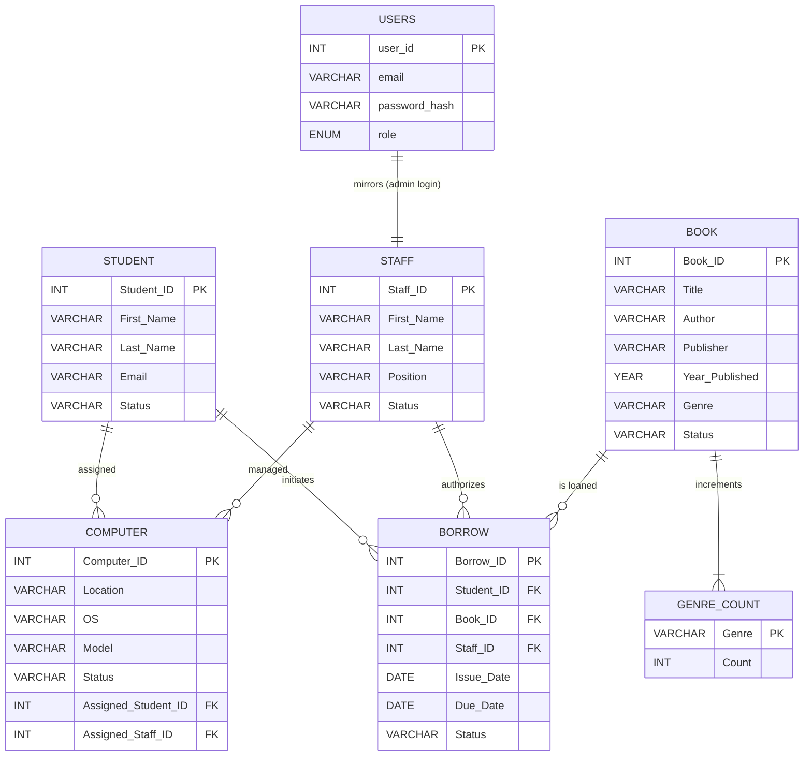

# Library Management System – Project Report

## 1. Cover Page
> **Problem Statement:** Design and implement a full-stack Library Management System with persistent storage, RESTful services, and operational analytics.
>
> **Course:** Database Management Systems Mini Project 2025
>
> **Team:**
> - Karan M  – karanm6505@gmail.com
> - Adithya Shetty - adithyas1204@gmail.com

> **Institution:** Department of Computer Science & Engineering
>
> **Submission Date:** 28 October 2025

## 2. Abstract
The Library Management System digitizes key library workflows spanning user authentication, catalog management, staff administration, and borrowing logistics. A MySQL schema defines normalized entities, while a Go-based REST API orchestrates validation and business rules. A React frontend delivers responsive dashboards, CRUD forms, and metadata tooling that expose stored routines and triggers. Together, the stack streamlines day-to-day operations and provides an extensible foundation for academic deployments.

## 3. User Requirement Specification (Review-1)
### Functional Requirements
- **F1 – User Authentication:** Allow administrators to sign in with hashed credentials and grant viewer access to regular users.
- **F2 – Student Registry:** Create, read, update status, and audit student profiles with email notifications queued for future enhancement.
- **F3 – Staff Directory:** Maintain staff roster with status tracking and role assignments.
- **F4 – Catalog Management:** Manage books with genre, availability status, and publishing metadata; update status via triggers on borrow/return events.
- **F5 – Borrow Lifecycle:** Record issue, return, and due dates for borrower transactions; enforce borrowing caps and overdue calculations.
- **F6 – Computer Lab Inventory:** Track workstation allocation to students/staff with operating system and health indicators.
- **F7 – Operational Dashboard:** Surface real-time aggregates (active students, available books, overdue counts) for administrators.
- **F8 – Metadata Utilities:** List tables, triggers, functions, and stored procedures; invoke routines securely via API endpoints.

### Non-functional Requirements
- **N1 – Availability:** Application must tolerate routine restarts via Docker without manual reseeding.
- **N2 – Security:** Passwords stored as bcrypt hashes; admin-only operations gated behind JWT auth middleware.
- **N3 – Performance:** Common API requests (list books, students) respond within 200 ms under typical lab workloads (<5 concurrent users).
- **N4 – Maintainability:** Server adopts layered architecture (handlers → repository) with dependency injection to ease testing.
- **N5 – Portability:** Containerized stack deploys on macOS, Linux, or Windows with Docker Desktop.

## 4. Technology Stack
| Layer | Technology |
|-------|------------|
| Database | MySQL 8.4 |
| Backend | Go 1.22, Chi router, `database/sql` + `go-sql-driver/mysql` |
| Frontend | React 18, Vite, TypeScript, Tailwind CSS |
| Tooling | Docker Compose, npm, sqlmock (testing), bcrypt for hashing |
| Hosting (optional) | Render / Railway-compatible containers |

## 5. ER Diagram


*Note:* `GENRE_COUNT` is populated exclusively by triggers; ensure the table exists before registering trigger scripts.

## 6. Relational Schema
| Table | Primary Key | Foreign Keys | Notable Attributes |
|-------|-------------|--------------|--------------------|
| `users` | `user_id` | — | `email` (UNIQUE), `password_hash`, `role`, timestamps |
| `student` | `Student_ID` | — | `Status` (Active/Inactive) |
| `staff` | `Staff_ID` | — | `Position`, `Status` |
| `book` | `Book_ID` | — | `Genre`, `Status` |
| `borrow` | `Borrow_ID` | `Student_ID` → `student`, `Book_ID` → `book`, `Staff_ID` → `staff` | `Issue_Date`, `Due_Date`, `Status` |
| `computer` | `Computer_ID` | `Assigned_Student_ID` → `student`, `Assigned_Staff_ID` → `staff` | `Location`, `OS`, `Model` |
| `genre_count` | `Genre` | — | `Count` (maintained by triggers) |

## 7. DDL Commands (Excerpt)
```sql
CREATE TABLE users (
    user_id INT AUTO_INCREMENT PRIMARY KEY,
    email VARCHAR(100) NOT NULL UNIQUE,
    password_hash VARCHAR(255) NOT NULL,
    role ENUM('admin', 'viewer') NOT NULL DEFAULT 'viewer',
    created_at TIMESTAMP DEFAULT CURRENT_TIMESTAMP,
    updated_at TIMESTAMP DEFAULT CURRENT_TIMESTAMP ON UPDATE CURRENT_TIMESTAMP
);

CREATE TABLE borrow (
    Borrow_ID INT PRIMARY KEY,
    Student_ID INT,
    Book_ID INT,
    Staff_ID INT,
    Issue_Date DATE,
    Due_Date DATE,
    Status VARCHAR(20),
    FOREIGN KEY (Student_ID) REFERENCES student(Student_ID),
    FOREIGN KEY (Book_ID) REFERENCES book(Book_ID),
    FOREIGN KEY (Staff_ID) REFERENCES staff(Staff_ID)
);

CREATE TABLE genre_count (
    Genre VARCHAR(50) PRIMARY KEY,
    Count INT NOT NULL DEFAULT 0
);
```
*Full DDL listings are provided in `ddl_dml.sql` and consolidated within `docs/full_project_queries.sql`.*

## 8. CRUD Operation Evidence
| Operation | Frontend Flow | Screenshot Placeholder |
|-----------|---------------|------------------------|
| Create Student | Dashboard → Students → “Add Student” modal | `screenshots/student-create.png` |
| Read Books | Dashboard → Books table with filters | `screenshots/books-list.png` |
| Update Borrow Status | Borrow detail drawer → “Mark Returned” | `screenshots/borrow-update.png` |
| Delete Staff | Staff list → context menu → “Deactivate” (logical delete) | `screenshots/staff-deactivate.png` |
> Replace placeholders with captured PNGs before final submission.

## 9. Feature Showcase
| Feature | Description | Screenshot Placeholder |
|---------|-------------|------------------------|
| Analytics Dashboard | Cards displaying active counts and overdue metrics. | `screenshots/dashboard-overview.png` |
| Metadata Explorer | Tables/functions/procedures viewer with execution forms. | `screenshots/metadata-browser.png` |
| Auth Workflow | Login form leveraging bcrypt hash comparison. | `screenshots/login.png` |
| Borrow Wizard | Multi-step modal to select student, book, and due date. | `screenshots/borrow-wizard.png` |

## 10. Database Logic Assets
### Triggers
1. `after_borrow_insert` – Marks a book as `Issued` when a borrow row is created.
2. `after_borrow_return` – Restores book status to `Available` upon status change.
3. `after_book_insert` – Increments `genre_count` tally for the inserted genre.
4. `before_book_delete` – Blocks deletion if book is still issued/borrowed.
5. `after_staff_insert` – Defaults staff status to `Active` if omitted.
6. `before_borrow_limit` – Enforces a max of three active borrows per student.

### Stored Procedures
- `add_new_book` – Inserts a title with default availability.
- `get_active_staff_list` – Lists staff with status `active`.
- `get_books_borrowed_by_student` – Returns books currently with a student.
- `get_books_borrowed_with_overdue` – Pairs titles with overdue days.
- `get_currently_borrowed_books` – Lists all issued books.
- `list_functions`, `list_procedures`, `list_triggers` – Introspection helpers.

### Stored Functions
- `active_staff_count()` – Counts active staff records.
- `borrowed_count(stu_id)` – Counts active borrows per student.
- `is_book_available(bookid)` – Boolean check on book status.
- `overdueby(due_date)` – Days elapsed since due date.
- `total_books_in_genre(genre_name)` – Genre-specific inventory.

### Complex Queries
- Nested Joins in `get_books_borrowed_by_student` (BOOK ⨝ BORROW).
- Aggregations via `active_staff_count`, `total_books_in_genre`.
- Nested subquery in `borrowed_count` for enforcement trigger.

## 11. Invoking Routines & Triggers – Code Snippets
### REST API
```bash
# Execute stored procedure via backend (admin JWT required)
curl -X POST \
  -H "Authorization: Bearer <token>" \
  -H "Content-Type: application/json" \
  -d '{"arguments": [1]}' \
  http://localhost:5050/api/schema/procedures/get_books_borrowed_by_student/execute

# Execute stored function
curl -X POST \
  -H "Authorization: Bearer <token>" \
  -H "Content-Type: application/json" \
  -d '{"arguments": ["Artificial Intelligence"]}' \
  http://localhost:5050/api/schema/functions/total_books_in_genre/execute
```

### Direct SQL (MySQL Shell)
```sql
CALL add_new_book('Refactoring', 'Martin Fowler', 'Addison-Wesley', 2019, 'Programming');
SELECT total_books_in_genre('Programming');

-- Trigger demo: attempt to insert 4th active borrow for Student 1
INSERT INTO borrow (Borrow_ID, Student_ID, Book_ID, Staff_ID, Issue_Date, Due_Date, Status)
VALUES (11, 1, 8, 2, CURDATE(), DATE_ADD(CURDATE(), INTERVAL 14 DAY), 'Issued');
-- Expected: SIGNAL "Cannot borrow more than 3 books at a time"
```

## 12. SQL Bundle
An aggregated script containing all CREATE, INSERT, trigger, function, and procedure statements is available at `docs/full_project_queries.sql`. Execute it from MySQL shell to reproduce the complete schema.

## 13. GitHub Repository
[https://github.com/karanm6505/dbms](https://github.com/karanm6505/dbms)

---
**Next Steps:** Capture high-resolution screenshots, extend API coverage for updates/deletes, and automate report generation with CI artifacts.
